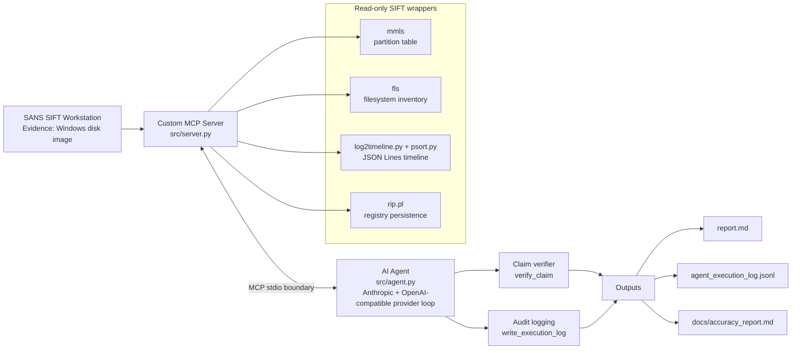
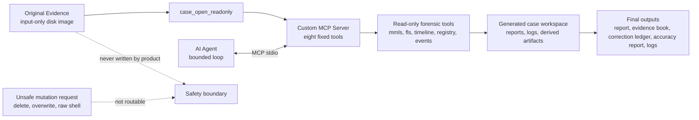
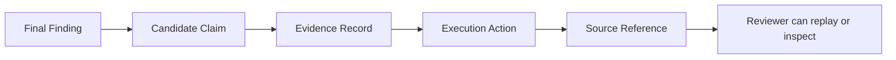
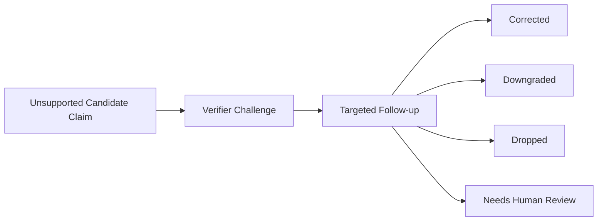

# Architecture

This project uses a narrow Custom MCP Server instead of broad shell access. The
agent can request forensic facts through typed, read-only tools, while evidence
mutation and generic command execution are outside the MCP surface.

Visual rule for public diagrams: forensic clarity, evidence-first structure,
and no decorative dashboard framing.

## Security Boundary

- The original evidence image is an input source only.
- Output files are written under the case workspace.
- The server exposes fixed MCP tools, not a generic shell.
- Backend command execution uses argument lists and allowlisted tool families.
- Destructive actions such as `rm`, overwrite, delete, or raw command execution
  are not routable through the MCP server.
- Findings must pass through `verify_claim` before being reported as confirmed.

## Judge-Readable Trust Boundary

For judging purposes, the architecture has one simple trust claim:

> The agent can ask for forensic facts, but it cannot ask the product to mutate
> the original evidence or run arbitrary shell commands.

This matters because the FIND EVIL! submission is evaluated on constraint
implementation and audit trail quality, not only on whether the final report
looks plausible.

Reviewer-facing guarantees:

- the evidence file is registered as read-only case input;
- the public MCP surface is limited to eight named forensic actions;
- generated reports, logs, indexes, and derived artifacts are separated from
  the original evidence path;
- parser failures become visible uncertainty instead of silent success;
- candidate findings are checked against collected evidence before becoming
  confirmed findings;
- unsupported or conflicted claims must be downgraded, dropped, or routed to
  human review;
- execution logs let reviewers trace a finding back to the tool action that
  produced the supporting evidence.

Current limitation:

- local API readiness does not equal full autonomous investigation completion;
  the real bounded CASE-RD01 pass exists through a SIFT-compatible WSL command
  surface and includes bounded SOFTWARE Run-key/SYSTEM service parsing,
  bounded EVTX event parsing, and bounded registry/event correlation, but full
  Plaso timeline and deeper process/account corroboration remain open.

## Judge-Readable Trust Boundary Diagram

## Evidence Chain Diagram

## Correction Loop Diagram

## Runtime Flow

1. `src/agent.py` starts `src.server` over MCP stdio.
2. The agent opens the case with `case_open_readonly`.
3. The agent gathers partition, filesystem, timeline, registry, and event
   evidence through typed MCP calls.
4. Candidate findings are verified with `verify_claim`.
5. Agent actions and corrections are written through `write_execution_log`.
6. The final analyst report is written to `report.md`.

## Current Eval Status

`docs/accuracy_report.md` now separates the real bounded CASE-RD01 evidence pass
from the historical synthetic fixture. The real pass demonstrates read-only
evidence access, volume boundary handling, high-signal artifact discovery,
self-correction for an unsupported compromise claim, and replayable execution
logs. It is not a full incident reconstruction.
